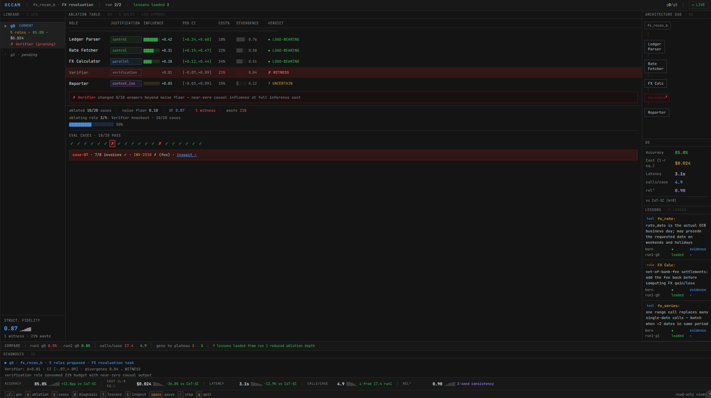
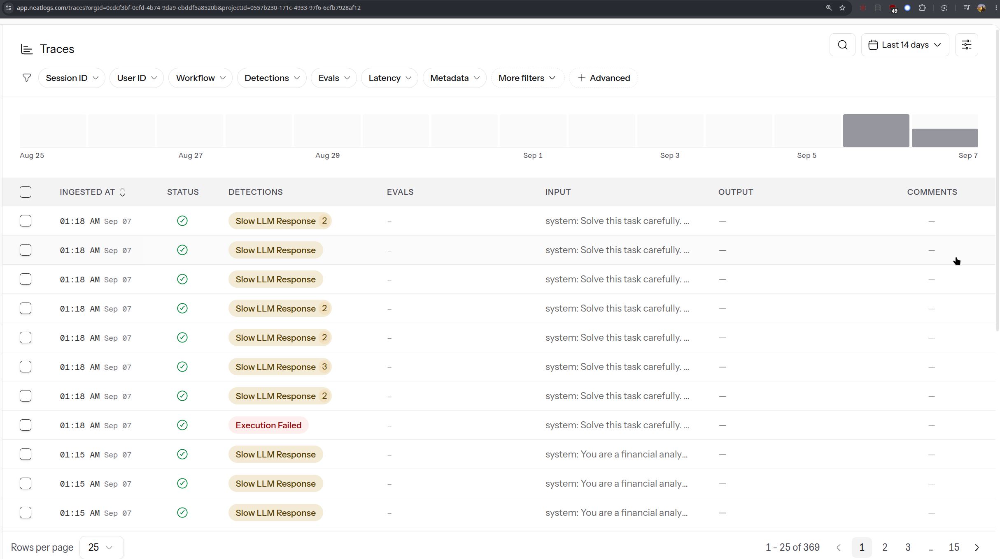

# OCCAM

**[Watch the OCCAM demo →](https://www.youtube.com/watch?v=uBUagVFSZSg)**

### Build the team. Measure every role. Remove what does not matter.

## Inspiration

We spent two days reading before writing a line of code. Track 1 said “design, test, and improve agents,” so we went down the whole rabbit hole—[ADAS](https://arxiv.org/abs/2408.08435), [AgentSquare](https://arxiv.org/abs/2410.06153), [AFlow](https://arxiv.org/abs/2410.10762), [GPTSwarm](https://arxiv.org/abs/2402.16823), the [Darwin Gödel Machine](https://arxiv.org/abs/2505.22954), harness optimization. Every paper said the same thing louder: automated multi-agent design works.

Then we found a June 2026 paper, [*The Illusion of Multi-Agent Advantage*](https://arxiv.org/abs/2606.13003), that audited six of those exact frameworks and said it does not. They lose to a *single* agent doing chain-of-thought, at up to 10× the cost. Agents agreed unanimously in over 90% of cases. An “all-assistant” setup beat task-specific experts. The paper’s term for agents that burn tokens without changing the answer stuck with us: **expensive witnesses**.

So we almost built something the literature had just disproven. Instead, we built the thing that paper asked for in its final paragraph: measure **structural fidelity**—whether each agent actually *causes* anything—and found nobody had.

## What it does

- Designs a multi-agent team, runs it on a real task, then **ablates every role**—reruns each case with that agent removed to see whether the answers change.
- **WITNESS** agents get pruned. **LOAD-BEARING** agents stay. **UNCERTAIN** agents never get touched.
- Diagnoses failures, mutates once, and loops. It **writes down lessons** about its tools that the next run’s architect reads first.
- Solves real accountant work: month-end FX revaluation of a multi-currency ledger using live ECB reference rates from the [Frankfurter API](https://frankfurter.dev), measured against a cost-matched single-agent baseline.

**Everyone else’s diagram grows. Ours shrinks.**

## How we built it

- Python and a Textual TUI, built with **AO**—parallel worker sessions on isolated Git worktrees, one work package per session, every merge a PR.
- **The engine and TUI share nothing but a directory.** The engine appends to an event log; the TUI tails it. Replay is indistinguishable from live, so the interface was built before the engine existed and every demo can be deterministic.
- Caching makes ablation affordable: knock out role 4 and roles 1–3 are cache hits.
- Tools are deliberately under-documented—nothing about ECB holidays, nothing about the batch endpoint. The agent has to earn those lessons.
- A leak guard rejects any lesson containing a date or a number. It must be a reusable rule, never an answer.
- FX ground truth has one definition: the [revaluation formula in `prd/02`](prd/02-DATA-AND-TASKS.md#12-the-formula-single-source-of-truth--grader-reference-implementation-and-readme-all-use-this). Book each invoice at its issue-date rate, value open invoices at the valuation-date rate or settled invoices at their settlement proceeds, then sum `value − booked` in INR.
- Traced end to end in **Neatlogs**; inference on **GLM-4.7-Flash via TensorMux** and **GPT-5 nano via AI Grants India**.
- Neatlogs org ID: 0cdcf3bf-0efd-4b74-9da9-ebddf5a8520b

## Challenges we ran into

- **Then the brief moved.** Mid-hackathon, the sponsors clarified that they wanted real third-party tools, not benchmark scores. We had three benchmarks wired up. We dropped all three and rebuilt the substrate on a live API overnight. The measurement layer—the actual idea—survived untouched, which is the only reason that was survivable.
- **We caught ourselves being wrong.** Going back to primary sources, we found errors in our own notes: a “35%” we had cited was cost, not accuracy. A quote we had attributed to Anthropic does not exist. An API quirk we were about to teach the agent turned out to be **completely false** when we tested it live. Teaching an agent a fake rule would have been worse than teaching it nothing.
- **Every provider had a trap.** Sonnet 5 *removed* sampling parameters—our code sent `temperature` on every call and got 400s, while curl worked because we had naturally omitted it. GLM’s hidden reasoning tokens consume `max_tokens` first, so truncation looks identical to an empty answer. Frankfurter silently ignores legacy parameter names and returns the wrong currency with a 200.
- **Rate limits, not tokens, were the wall.** Fifty million granted tokens, and we were still throttled at roughly 15 requests a minute.
- **We hardened a sandbox nobody asked for.** Hours went into `python_exec` security that belonged to the demo. Better system, wrong call on the clock.
- **The last mile got us.** The full loop reached generation one on real cases with real API calls and a valid event log. Accuracy convergence is where the clock won.

## Accomplishments that we’re proud of

- **The paper’s finding reproduced itself inside our tool.** We made every role declare *why* it exists. We never told the system which justifications were suspect, but the red **WITNESS** rows came back `verification` and `ensemble`, while the green **LOAD-BEARING** rows came back `parallel` and `context_isolation`. That is the paper’s conclusion, rediscovered live on a finance task by a system nobody told.
- **We were honest about noise from day one.** Models are not deterministic even at temperature 0, so we *measure* the noise floor before every ablation, compare per case instead of in aggregate, report confidence intervals, and refuse to prune anything statistically unresolved. Leave-one-out is a first-order Shapley approximation, and we say so out loud rather than hoping nobody asks.
- **We shipped a spec, not just code.** Eleven PRD documents were written before implementation—which is why two people plus a fleet of agents did not collide, and why a mid-hackathon pivot cost one rewrite instead of a restart.

## What we learned

- **Measure the parts, not the whole.** Everyone reports end-to-end accuracy. Almost nobody asks whether each piece earned its tokens. Once you ask, a lot of architecture turns out to be decoration.
- **“The agent failed” is usually a lie.** Nearly every bug was a contract mismatch—a dropped parameter, a reasoning field consuming a budget, an ignored query argument. Suspect the plumbing before the model.
- **Read the newest paper before you build on the popular one.** Two days of reading nearly sent us off to build a 2024 idea. The same two days gave us the whole project.
- **Restraint is invisible.** A system that correctly declines to add an agent is doing something better than one that adds five—and it looks like nothing happening. Making that visible was as hard as the algorithm.

## What’s next for OCCAM

- Ablate the lessons too—prune memory that never changed an outcome.
- Publish structural fidelity as a metric across the major frameworks. If the paper is right, most score badly.
- Add pairwise ablation for roles that matter only together.
- Add more tool environments—a task is just two files. Email, payments, issue triage. We picked FX for deterministic ground truth, not because the engine needs finance.
- Build an efficient frontier: not the smallest team that works, but the best architecture at every cost ceiling—and the exact point where another agent stops paying for itself.
